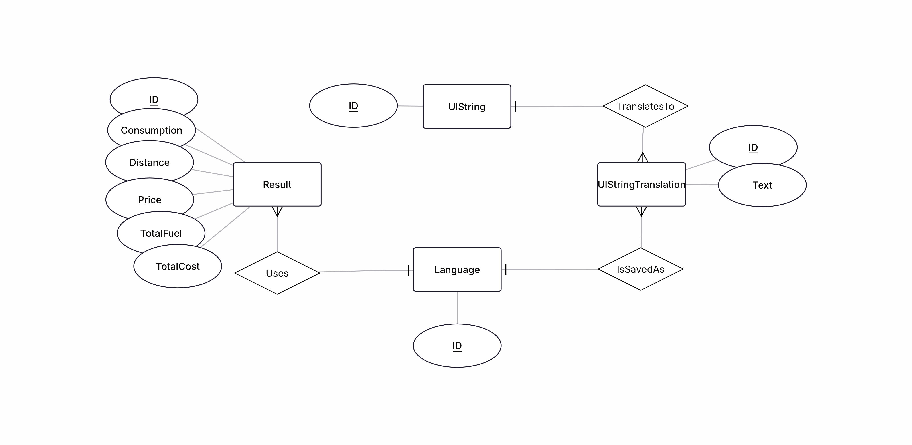

# Localized Fuel Consumption Calculator


## Database localization


`UIString` uses string name such as label-distance as id since those are unique
<br>
`Language` uses iso639 language code as id as those are always unique

Database is modeled using JPA ORM and uses MariaDB driver.

### Setup
1. Create a database
```sql
CREATE DATABASE fuel_consumption_db;
```
2. Grant privileges to your user
```
GRANT ALL PRIVILEGES ON fuel_calculation_db.* TO 'appuser'@'localhost';
```
3. Run [init.sql](sql/init.sql) to create the localization tables and insert initial data

4. Update your information to `src/main/resources/META-INF/persistence.xml`

5. Run the application, JPA creates the `result`-table automatically
